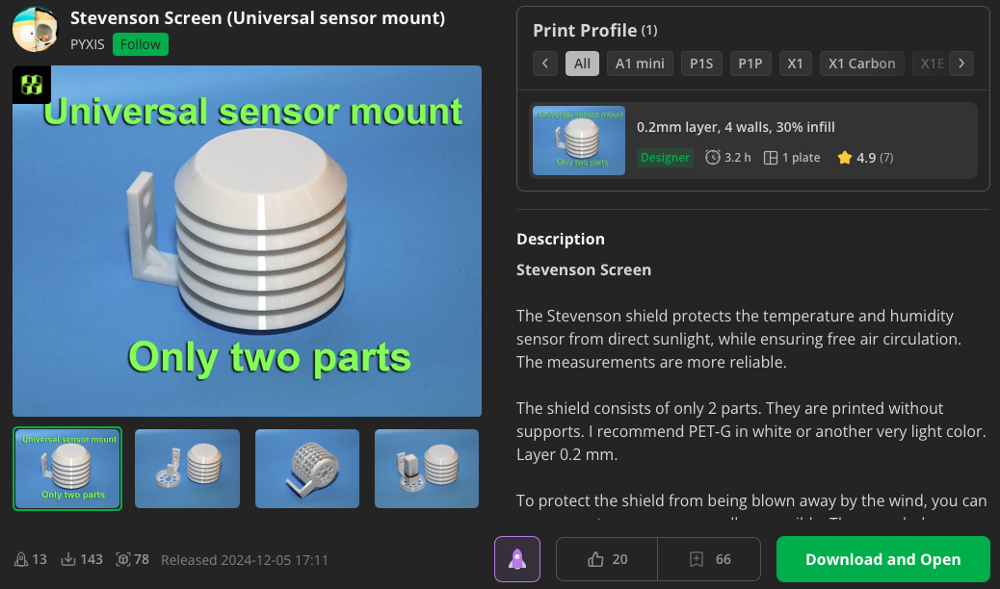

# `hardware/3D_design`

This directory contains 3D designs for parts used in the project.

# Prior work

The Stevenson screen used in this work was adapted from the version originally created by [PYXIS. (2025, September 16). Stevenson Screen (Universal sensor mount) [STL file]. Bambu Studio](https://makerworld.com/de/models/851650-stevenson-screen-universal-sensor-mount?from=search#profileId-799909).

