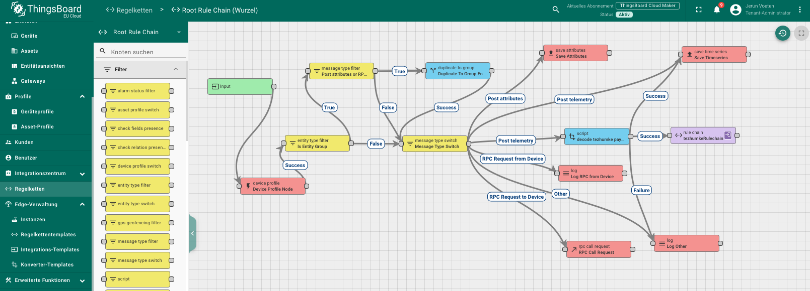
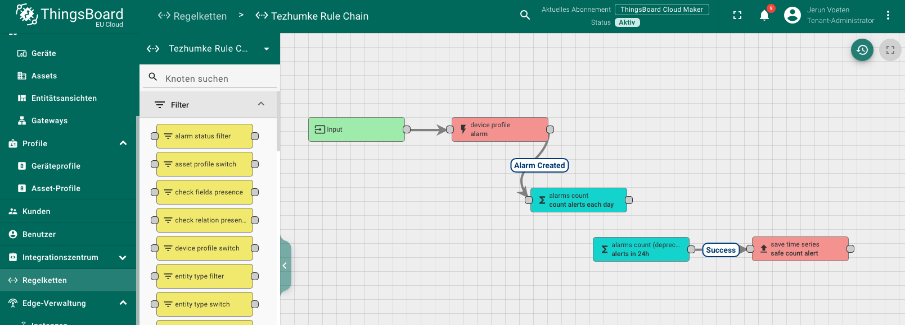

# `src/ThingsBoard`

This folder contains the ThingsBoard configurations. The scripts can be uploaded in ThingsBoard on the respective pages.

Device profile settings:
    
- `dragino_device_profil.json`

Dashboard configuration:

- `indoor_measurements.json`
- `outdoor_measurements.json`

Rule chains:

- `root_rule_chain.json`
- `tezhumke_rule_chain.json`
- 
The `thingsboardMainScript.js` corresponds to the “decode tezhumke payload” script in the root rule chain and is responsible for decoding all payloads.

